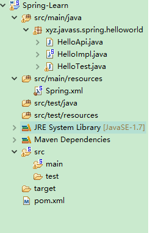

### 1.第一个Spring例子
#### 1.1项目结构

#### 1.2 各个文件源码

 1. HelloApi.java

``` java
package xyz.javass.spring.helloworld;
/**
 * 
 * @ClassName HelloApi
 * @Description 实现hello接口
 * @author Quinntian
 * @Date 2018年5月11日 下午5:01:20
 * @version 1.0.0
 */
public interface HelloApi {
     public void sayHello();
	

}
```
2. HelloImpl.java

``` java
package xyz.javass.spring.helloworld;
/**
 * 
 * @ClassName HelloImpl
 * @Description TODO(这里用一句话描述这个类的作用)
 * @author Quinntian
 * @Date 2018年5月11日 下午5:02:37
 * @version 1.0.0
 */
public class HelloImpl implements HelloApi {

    @Override
    public void sayHello() {
        // TODO Auto-generated method stub
            System.out.println("Hello World");
    }

}

```


3. HelloTest.java

``` java
package xyz.javass.spring.helloworld;

import org.junit.Test;
import org.springframework.context.ApplicationContext;
import org.springframework.context.support.ClassPathXmlApplicationContext;
import org.springframework.context.support.FileSystemXmlApplicationContext;


public class HelloTest {

    @Test
    public void testHelloworld(){
       //1.读取配置文件实例化一个IOC容器
        ApplicationContext context = new ClassPathXmlApplicationContext("classpath:Spring.xml");
       //2.从容器中获取Bean
        HelloApi helloApi = context.getBean("hello",HelloApi.class);
       //3.执行业务逻辑
        helloApi.sayHello();
    }

   

}

```
4. Spring.xml

```xml
<?xml version="1.0" encoding="UTF-8"?>
<beans xmlns="http://www.springframework.org/schema/beans"
	xmlns:xsi="http://www.w3.org/2001/XMLSchema-instance"
	xmlns:context="http://www.springframework.org/schema/context"
	xsi:schemaLocation="http://www.springframework.org/schema/beans http://www.springframework.org/schema/beans/spring-beans.xsd
		http://www.springframework.org/schema/context http://www.springframework.org/schema/context/spring-context-3.0.xsd">

<bean id="hello" class="xyz.javass.spring.helloworld.HelloImpl"></bean>
</beans>

```


