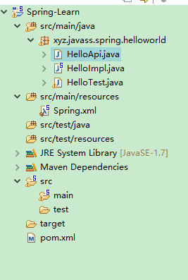

# 获取bean组件的方式

 1. 通过ID
 2. 通过全类名
 3. 通过Name
 ## 例子
 ### Java文件

``` java
public class HelloTest {
    /**
     * 
     * @Description 通过ID获取bean
     */
//    @Test
//    public void testHelloworld(){
//       //1.读取配置文件实例化一个IOC容器
//        ApplicationContext context = new ClassPathXmlApplicationContext("classpath:Spring.xml");
//       //2.从容器中获取Bean
//        HelloApi helloApi = context.getBean("hello",HelloApi.class);
//       //3.执行业务逻辑
//        helloApi.sayHello();
//    }
    /**
     * 
     * @Description 通过全类名获取ID
     */
//    @Test
//    public void testHelloworldByClass(){
//        //1.读取配置文件实例化一个IOC容器
//         BeanFactory beanfactory = new ClassPathXmlApplicationContext("classpath:Spring.xml");
//        //2.从容器中获取Bean
//         HelloApi helloApi = beanfactory.getBean(HelloApi.class);
//        //3.执行业务逻辑
//         helloApi.sayHello();
//     }
    /**
     * 
     * @Description 通过名称获取
     */
//    @Test
//    public void testHelloworldByname(){
//      //1.读取配置文件实例化一个IOC容器
//       BeanFactory beanfactory = new ClassPathXmlApplicationContext("classpath:Spring.xml");
//      //2.从容器中获取Bean
//       HelloApi helloApi = beanfactory.getBean("hello",HelloApi.class);
//      //3.执行业务逻辑
//       helloApi.sayHello();
//   }
    

   

}
```
### xml配置

``` xml
<?xml version="1.0" encoding="UTF-8"?>
<beans xmlns="http://www.springframework.org/schema/beans"
	xmlns:xsi="http://www.w3.org/2001/XMLSchema-instance"
	xmlns:context="http://www.springframework.org/schema/context"
	xsi:schemaLocation="http://www.springframework.org/schema/beans http://www.springframework.org/schema/beans/spring-beans.xsd
		http://www.springframework.org/schema/context http://www.springframework.org/schema/context/spring-context-3.0.xsd">
<!-- 通过ID定义 -->
<!--  
<bean id="hello" class="xyz.javass.spring.helloworld.HelloImpl"></bean>-->
<!-- 通过全类名定义 -->
<!-- 
<bean class="xyz.javass.spring.helloworld.HelloImpl"></bean>-->
<!-- 通过名称定义 -->
<bean name="hello" class="xyz.javass.spring.helloworld.HelloImpl"></bean>
</beans>
```
### 文件结构



