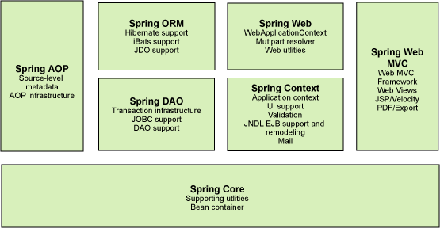

### 1.1 什么是Spring 

 - Sping 是一个轻量级企业开发的一站式解决方案，用于解决Java EE开发中的所有问题。Spring框架主要提供IOC容器、AOP、数据访问、WEB开发、消息、测试相关技术的支持
 - Spring 采用简单的POJO来进行企业级开发。
 - POJO：Plain Ordinary Java Object简单的Java对象，实际就是普通JavaBeans，是为了避免和EJB混淆所创造的简称。
 - Java对象->Bean<-IOC容器来初始化，提供依赖管理和对象使用。
#### 1.1.1 Spring中的模块

（1）核心容器
　　Spring-Core：核心工具类  
　　Spring-Beans：Spring定义bean的支持  
　　Spring-Context：运行时Spring容器  
　　Spring-Context：Spring容器对第三方包的集成支持  
　　Spring-Expression：使用表达式语言在进行查询时和操作的对象
