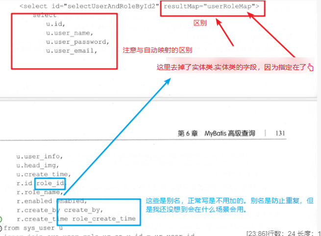
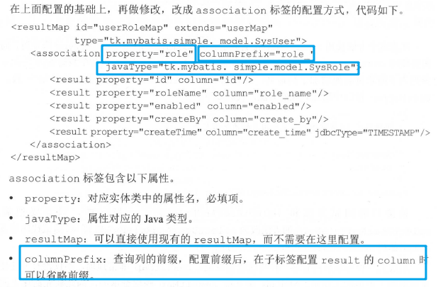
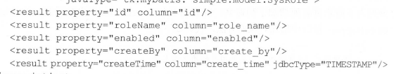

[toc]

## 1. 一对一查询

> 1.1-1.3 我们假设场景为用户和角色一对一，根据数据库基本原理，我们把外键设置在用户一边，即在实体类中添加角色这个属性。

### 1.1 一对一自动映射处理查询
#### 1.1.1嵌套结果查询的核心思想
- 核心思想：直接用**slect**标签通过数据库字段和实体类字段的自动映射。
	- 首先在select语句中指明映射关系。
	- 然后我们看**resultType**的值是一个实体类。
	- 自动映射到实体类。
- 应用在场景中：我们假设用户和角色之间是一对一，在用户类中一个属性是角色 sysrole类型的，查询用户的时候把所归属的角色查询出来，那么其就可以写成如图所示。
	- user_name userName代表数据库字段和实体类中字段
	- r.id "role.id"此处是通过别名映射的，role是什么？是声明在user类中属性。

#### 1.1.2 嵌套结果查询优缺点
 1. 什么是？通过了一次查询把结果映射到了不同对象里。
 2. 好处是什么？减少了数据库查询次数，减少了数据库的压力。
 3. 坏处是什么？要写复杂的SQL，不容易写对，由于要映射到不同的对象中，一定程度上增加了服务器的压力。
 
 ### 1.2 使用resultMap配置一对一映射查询
 #### 1.2.1 具体应用过程
 我们在1.1中使用的方法是直接在**select标签中**直接写后**自动映射**到实体类，**resultType**返回类型是一个实体类。还有一种方法是在xml文件中的<resultMap>标签配置关系，然后再在select的**resultType**指定返回resultMap。详细如图所示：
 
 **property**是实体类字段名，**colum**是数据库字段名。此处**resultMap**这个标签是定义了一种**映射关系集合**,这个集合的类型对应实体类User,所以**type**指定了一个实体类。同样我们在property中仍可以使用**别名**.字段的方法，同1.1。
 那么我们来看，**select语句**是怎么写的。

 #### 1.2.2 注意事项
 **注意**的是：去掉了数据库字段，直接用实体类属性查询。至于那个**别名问题**，暂时还没有想到会出现的场景，只需记住若是使用别名**别名和resultMap的column一致**。
 #### 1.2.3 简化写法
 首先我们看这张图
 
 在实际的场景中我们一般会单独为user写一个映射文件（这个映射文件通常是自动生成工具生成的）里面，resultMap会写成如图所示。这时候，我们要加一个嵌套查询的方法，那么resultMap需要添加一个？这时候我们要在写一个，如1.2.1图，我们会发现有好多重复的内容。如下图所示。
 
 这个时候，我们引入一种**继承（增加extend属性）**机制。改成如下图所示。
 
 ### 1.3 使用resultMap的association标签配置一对一映射
 
 - 在这里我们使用了association那么**property**中就直接写**属性名**就可以。
 - 这里我们配置了**列的前缀**，则在**Column**就可以省略，但是**select**就要更改如下。
 
 - 关于**association**的**resultMap**属性应用场景
 我们可以把角色的关联单独拿出来。
 
 把这部分单独放到一个resultMap标签中，然后直接代用即可。

	 - 注意事项
	 - 同xml可以使用ID，不在同一xml用全类名+ID如上图。
	 
### 1.4 association标签查询（懒加载）

> 此处我们假设场景是新的，用户和博客存在一对一关系，按照数据库设计的基本原理，我们再user中设置外键指向blog表，对应实体类就是user类中增加Blog类型的blog属性。

#### 1.4.1 与前1.1-1.3三种方式的区别
- 前三种方式都是复杂查询
- 前三种方式都是一次性复杂查询，映射到不同的对象中。
- 此种方法可以理解为简单查询，后再根据业务逻辑手动查询关联对象，所以出现了急速加载和懒加载的概念。

#### 1.4.2 具体实例

association中的属性介绍
- select：从查询ID
- column:从查询入参=主查询字段名，见图。可以包含多个用{查询入参=主查询字段名，....}
- fetchType:数据加载方式

查询语句执行顺序
- 执行主查询->执行从查询
- 先查出用户，然后根据用户中的blogId去执行从查询，依次轮流有多少用户查多少次主查询->从查询，主查询->从查询，主查询->从查询，主查询->从查询......

存在问题
- 如果我们查出来从查询的数据，即博客，这个数据并没有用呢？
- 如果我们用户查询主查询用户有N个，则需要执行N次查询，每次主查询会再查询依次从查询，则会出现N+1的问题。（其实就是eager加载问题对比JPA）

解决方法

 - 增加fetchtype属性设定为eager,这样只有我们在getBlog()方法才会执行从查询。

我们观察运行结果，会出现从查询依旧会被执行，而不是再调用getBlog方法才执行。
**原因及解决方法** ：在mybatis**全局配置**中有一个属性aggressive-lazy-loading: false，这个参数默认为true,即如果为true,不管你是否设置lazy都会全部加载。

- 懒加载注意事项

- 当我们设置好aggressive-lazy-loading: false，我们如果想进行从查询呢？

